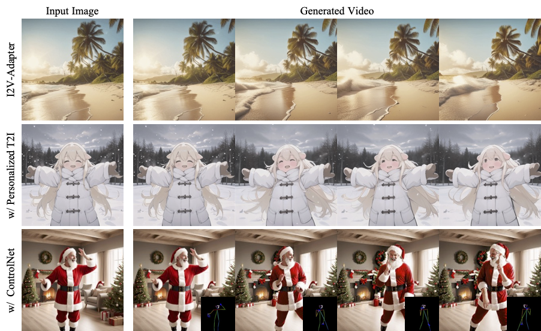

## I2V-Adapter: A General Image-to-Video Adapter for Diffusion Models
<a href='https://i2v-adapter-paper.github.io/'></a> 
<a href='https://arxiv.org/abs/2312.16693'></a> 

<p align="left">
  
</p>

## 🔆 Introduction
This is a PyTorch/GPU implementation of the paper [I2V-Adapter: A General Image-to-Video Adapter for Diffusion Models](https://arxiv.org/abs/2312.16693)


### Setup repository and conda environment

```
git clone https://github.com/KwaiVGI/I2V-Adapter.git
cd I2V-Adapter

conda env create -f environment.yaml
conda activate i2v_adapter
```

### Download pretrained models

```
git lfs install
git clone https://huggingface.co/runwayml/stable-diffusion-v1-5 pretrained_models/stable-diffusion-v1-5
git clone https://huggingface.co/space-xun/i2v_adapter pretrained_models/I2V-Adapter
git clone https://huggingface.co/h94/IP-Adapter pretrained_models/IP-Adapter
mv pretrained_models/I2V-Adapter/animatediff_v15_v1_ipplus.pth pretrained_models/stable-diffusion-v1-5/unet/
```

### Inference

```
bash infer.sh
```


## BibTeX
```
@inproceedings{guo2023i2v,
author = {Xun Guo, Mingwu Zheng, Liang Hou, Yuan Gao, Yufan Deng, Pengfei Wan, Di Zhang, Yufan Liu, Weiming Hu, Zhengjun Zha, Haibin Huang, Chongyang Ma},
title = {I2V-Adapter: A General Image-to-Video Adapter for Diffusion Models},
year = {2024},
booktitle = {SIGGRAPH 2024 Conference Papers}
}
```

## 🤗 Acknowledgements
Codebase builds on [Diffusers](https://github.com/huggingface/diffusers) and [AnimateDiff](https://github.com/guoyww/AnimateDiff).